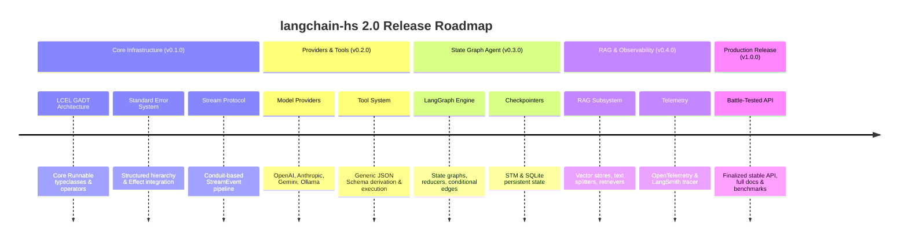

# Product Requirements Document (PRD)

## Project: `langchain-hs` 2.0 – Production-Grade Haskell LLM Application Framework

- **Status**: Draft / Proposed
- **Author**: Maintainer & AI Architect
- **Version**: 2.0.0-PRD
- **Target GHC Versions**: GHC 9.4.8, 9.6.6, 9.8.4, 9.10.1

---

## 1. Vision & Executive Summary

`langchain-hs` 2.0 aims to be the standard-setting, production-ready, type-safe framework for building LLM-powered applications, multi-agent state machines, and RAG pipelines in Haskell. 

While existing libraries in Python and JavaScript offer rich ecosystems, they suffer from runtime dynamic typing failures, unhandled async race conditions, and heavy memory overhead. `langchain-hs` 2.0 leverages Haskell's advanced type system (GADTs, Type Families, Effect Systems, Generics) to provide **Correctness by Construction**, **Zero-Cost Streaming Composition**, and **Deterministic Multi-Agent Orchestration**.

---

## 2. Comprehensive Cross-Implementation Feature Comparison Matrix

The table below presents an empirical feature audit comparing the 6 implementations available in the workspace:
1. `langchain-python` (Python core / LangChain ecosystem)
2. `langchain` (Elixir core)
3. `langchain-rust` (Rust crate)
4. `langchain4j` (Java framework)
5. `langchaingo` (Go module)
6. `langchain-hs` 1.0 (Current legacy Haskell package)
7. **`langchain-hs` 2.0** (Proposed rewritten Haskell framework)

### Status Legend
- **FULL**: Native, production-grade first-class feature with full capabilities.
- **PARTIAL**: Basic or incomplete implementation; lacks key abstractions, safety guarantees, or edge-case handling.
- **MISSING**: Feature is completely absent from the implementation.

---

### Feature Matrix

| Feature Dimension | Python (`langchain-python`) | Elixir (`langchain`) | Rust (`langchain-rust`) | Java (`langchain4j`) | Go (`langchaingo`) | Haskell 1.0 (`langchain-hs` v1) | **Haskell 2.0 (`langchain-hs` v2)** |
| :--- | :--- | :--- | :--- | :--- | :--- | :--- | :--- |
| **1. Monadic Effect / Context Agnostic** | **MISSING** (Tied to Python `asyncio` / sync thread loops) | **PARTIAL** (Tied to OTP processes / GenServer) | **PARTIAL** (Tied to Tokio async runtime) | **PARTIAL** (Tied to imperative JVM threads / RxJava) | **PARTIAL** (Tied to `context.Context`) | **MISSING** (Hardcoded concrete `IO` calls) | **FULL** (Monad-polymorphic `m`, `effectful` / `mtl` effect stack) |
| **2. Declarative Chain Algebra (LCEL)** | **FULL** (`RunnableSequence`, `Parallel`, `Branch`, `Lambda`, `Fallback`) | **MISSING** (No pipeline expression language; manual function piping) | **PARTIAL** (Basic `Chain` trait; no parallel / branch GADTs) | **PARTIAL** (Fluent builders & AiServices proxies; no LCEL AST) | **PARTIAL** (Simple `Chain` interface; no parallel composition) | **PARTIAL** (Basic `RunnableSequence` GADT; `(|>>)` executes immediately in `IO`) | **FULL** (Pure GADT pipeline AST with `Seq`, `Par`, `Branch`, `Fallback`, `Lambda`) |
| **3. Compile-Time Type Safety across Chains** | **MISSING** (Runtime Pydantic dynamic duck typing) | **MISSING** (Dynamic runtime struct specs / Dialyzer) | **PARTIAL** (Static trait bounds, but dynamic graph payloads) | **PARTIAL** (Java generics, but dynamic reflection heavy) | **MISSING** (Interface `{}` dynamic assertions) | **PARTIAL** (Associated type families on concrete `IO`) | **FULL** (Compile-time verified input/output type matching via GADTs) |
| **4. Standardized Event Stream Protocol** | **FULL** (`astream_events` v1/v2 standard JSON protocol) | **PARTIAL** (Delta process messages to client process) | **PARTIAL** (Raw string chunk stream via `futures::Stream`) | **PARTIAL** (`TokenStream` callback handler) | **PARTIAL** (`StreamingFunc` chunk callback) | **MISSING** (Imperative `token -> IO ()` callbacks) | **FULL** (Standard `Conduit`-backed `StreamEvent` pipeline with lifecycle events) |
| **5. Multi-Modal Message Payloads** | **FULL** (`ContentBlock` text, image, audio, video arrays) | **PARTIAL** (Text & base64 image support) | **PARTIAL** (Text & image URL support) | **FULL** (`TextContent`, `ImageContent`, `AudioContent`) | **PARTIAL** (Text & image URL support) | **MISSING** (Text-only content string field) | **FULL** (Typed `ContentBlock` sum types: text, image, audio, byte payloads) |
| **6. Automated Tool Schema Compiler** | **FULL** (Pydantic models / function docstring parser) | **PARTIAL** (Manual map definitions / Elixir struct specs) | **PARTIAL** (`AsyncFn` macros with manual JSON Schema) | **FULL** (`@Tool` annotation parser & reflection schema compiler) | **MISSING** (Manual `jsonschema.Definition` struct construction) | **MISSING** (String-in / string-out functions without schema) | **FULL** (Automatic JSON Schema compilation via `GHC.Generics` + `Aeson`) |
| **7. Structured Output Parsing** | **FULL** (`with_structured_output` using Pydantic / JsonSchema) | **PARTIAL** (JSON parsing helpers) | **PARTIAL** (Basic JSON output parser) | **FULL** (`AiServices` structured return interfaces) | **PARTIAL** (Basic parser interface) | **PARTIAL** (String JSON parsing functions) | **FULL** (Type-safe parsing via `FromJSON` + generic tool execution) |
| **8. Cyclic State-Graph Engine (LangGraph)** | **FULL** (LangGraph `StateGraph`, `Node`, `Edge`, `Command`, `Send`) | **MISSING** (No graph state machine engine) | **MISSING** (No graph state machine engine) | **MISSING** (Only linear/agentic loop proxies) | **MISSING** (Only basic tool execution loop) | **MISSING** (Imperative `while` loop with max steps counter) | **FULL** (Native `LangGraph-hs` directed cyclic `StateGraph` engine) |
| **9. Pure Graph State Reducers** | **FULL** (`Annotated` reducer functions per state key) | **MISSING** | **MISSING** | **MISSING** | **MISSING** | **MISSING** | **FULL** (Pure functional state reducer functions `s -> s -> s`) |
| **10. Persistent Checkpointers & Time Travel** | **FULL** (`MemorySaver`, `SqliteSaver`, `PostgresSaver`) | **MISSING** | **MISSING** | **MISSING** | **MISSING** | **MISSING** | **FULL** (Durable checkpointer interfaces: `STMCheckpointer`, `SQLiteCheckpointer`) |
| **11. Human-In-The-Loop (HITL) Interrupt / Resume** | **FULL** (`interrupt()` primitive, state patch & resume) | **MISSING** | **MISSING** | **MISSING** | **MISSING** | **MISSING** | **FULL** (Native interrupt state nodes & checkpoint resume signals) |
| **12. RAG & Vector Store Ecosystem** | **FULL** (100+ loaders, splitters, hybrid search, re-rankers) | **PARTIAL** (Basic text splitters & memory vector store) | **PARTIAL** (Basic token splitters, fastembed, vector memory) | **FULL** (Comprehensive embedding store integrations) | **PARTIAL** (Basic splitters, pgvector, pinecone, chroma) | **PARTIAL** (Basic PDF/File loader, character splitter, in-memory store) | **FULL** (Comprehensive RAG package: `RecursiveCharacterSplitter`, `HNSW` vector store, `Conduit` document loaders) |
| **13. Telemetry & Observability Tracing** | **FULL** (LangSmith, OpenTelemetry, `RunManager` callbacks) | **PARTIAL** (Telemetry events via Elixir `:telemetry`) | **MISSING** (No built-in tracing middleware) | **FULL** (Micrometer metrics, OpenTelemetry spans) | **MISSING** (No tracing middleware) | **MISSING** (No tracing context or span propagation) | **FULL** (Built-in OpenTelemetry span tracing & LangSmith exporter) |
| **14. Concurrency Safety & Resource Cleanup** | **PARTIAL** (GIL bottlenecks, dynamic async leaks) | **FULL** (BEAM actor fault tolerance & process isolation) | **FULL** (Ownership model, zero runtime leaks) | **PARTIAL** (JVM thread pools, dynamic resource cleanup) | **FULL** (Goroutines, `context.Context` cancellation) | **PARTIAL** (Basic `Async` library calls; handle leak risk) | **FULL** (Resource-safe streaming via `ResourceT`, STM thread-safe state) |

---

## 3. Deep Dive into Missing Functionality Across Implementations

### 3.1 Gaps in Python (`langchain-python`)
- **Compile-Time Safety**: Pipelines fail at runtime if a step output type does not match the next step input type.
- **Resource Leaks in Async Streams**: Exception handling inside complex `astream_events` generators can swallow teardown logic.

### 3.2 Gaps in Elixir (`langchain`)
- **No LCEL Chain Algebra**: Lacks a formal composable pipeline language (like `RunnableSequence` or `RunnableBranch`); users must manually pipe data through Elixir functions.
- **No Graph Agent Engine**: Lacks graph state machines, persistent checkpointers, state reducers, or time-travel debugging.

### 3.3 Gaps in Rust (`langchain-rust`)
- **Missing LCEL AST**: `Chain` trait is non-compositional for complex parallel, branching, or fallback topologies.
- **No Agent State-Graph System**: Lacks a LangGraph equivalent for state-machine agents and persistent checkpointers.
- **No Structured Streaming Events**: Streaming emits raw string tokens without event lifecycle metadata (`on_tool_start`, `on_chain_end`).

### 3.4 Gaps in Java (`langchain4j`)
- **No Declarative Expression Language**: Uses imperative class method calls and dynamic proxy annotations (`@AiService`) rather than pure functional pipeline algebra.
- **No Graph State-Graph Engine**: Lacks native state-machine graphs, conditional edge routers, or persistent checkpointers.

### 3.5 Gaps in Go (`langchaingo`)
- **Weak Type Algebra**: Relies on `interface{}` dynamic payload casting for complex chains.
- **No Graph State Machine or Event Protocol**: Lacks state graph execution, checkpointing, and fine-grained event streaming.

### 3.6 Gaps in Legacy Haskell 1.0 (`langchain-hs`)
- **Hardcoded Concrete `IO`**: All typeclasses mandate `IO`, rendering effect handlers or pure unit tests impossible.
- **Imperative Side-Effecting Streaming**: Uses `token -> IO ()` callback functions rather than resource-safe streaming pipelines (`Conduit`).
- **No Tool Schema Derivation**: Tools require manual string input/output handling.
- **No Agent Graph Engine & Telemetry**: Agent loop is a simple `while` loop with no state persistence or observability.

---

## 4. Product Principles for `langchain-hs` 2.0

1. **Type-Safe by Construction**: Inconsistent pipeline inputs/outputs, invalid tool schemas, or malformed state transitions MUST trigger compile-time errors, not runtime exceptions.
2. **Monad-Agnostic / Effect-Friendly**: Components must NOT be locked into concrete `IO`. They must operate over arbitrary monadic stacks (`MonadIO m`, `MonadUnliftIO m`, or algebraic effect handlers like `effectful`).
3. **First-Class Streaming & Observability**: Streaming is not an afterthought or imperative callback; it is a primary data protocol (`Conduit` stream emitting `StreamEvent`s).
4. **Deterministic Agentic State Machines**: Abandon rigid `while` loops for agent execution in favor of a directed cyclic state graph engine (LangGraph paradigm) with persistent checkpointers and human-in-the-loop (HITL) capabilities.
5. **Zero Modesty in Ergonomics**: Simple tasks must take 3 lines of code; complex multi-agent workflows must remain readable and modular.

---

## 5. Target Personas & Use Cases

- **Haskell Backend Engineers**: Building enterprise LLM microservices, customer support bots, automated code synthesis, or semantic search APIs requiring high throughput and zero crashes.
- **AI Systems Engineers & Researchers**: Designing deterministic agentic workflows with strict safety bounds, structured output validation, and complete audit tracing.
- **Data & Fintech Architects**: Requiring auditability, exact type guarantees on financial/regulatory outputs, and local privacy-preserving LLM execution via Ollama/Llama.cpp.

---

## 6. Functional Requirements

### FR-1: Type-Safe LangChain Expression Language (LCEL)
- **FR-1.1**: The framework MUST provide a composable `Runnable` abstraction capable of sequential composition (`RunnableSequence`), parallel composition (`RunnableParallel`), conditional branching (`RunnableBranch`), fallbacks (`RunnableWithFallback`), and lambda transformations (`RunnableLambda`).
- **FR-1.2**: Sequential composition (`|>>`) MUST ensure at compile-time that `Output(Runnable A) == Input(Runnable B)`.
- **FR-1.3**: Parallel composition (`&>&`) MUST accept inputs and yield strongly-typed records or tuples of outputs concurrently using async execution.

### FR-2: Standardized Model & Provider Layer
- **FR-2.1**: Unified typeclass `ChatModel` supporting synchronous invocation (`invoke`), asynchronous batching (`batch`), and streaming (`stream`).
- **FR-2.2**: First-class support for major providers: OpenAI (GPT-4o), Anthropic (Claude 3.5 Sonnet), Google Gemini (Gemini 1.5/2.0), Ollama (Local LLMs), and DeepSeek.
- **FR-2.3**: Built-in support for provider configuration (Temperature, TopP, MaxTokens, StopSequences, Reasonable Default parameters).

### FR-3: Type-Safe Dynamic Tool System & Schema Derivation
- **FR-3.1**: Haskell functions and data types MUST automatically derive tool definitions (JSON Schema format) via `GHC.Generics` and `Aeson`.
- **FR-3.2**: Tool invocation MUST validate parameters against expected types and return strongly typed structured errors on parsing failures.
- **FR-3.3**: Support for multimodal tool inputs (text, image, raw byte payloads).

### FR-4: Standardized Event Streaming Protocol (`astream_events`)
- **FR-4.1**: Components MUST support streaming via `Conduit` streams yielding structured `StreamEvent` tokens.
- **FR-4.2**: `StreamEvent` MUST capture fine-grained lifecycle events:
  - `EventLLMStart`, `EventLLMChunk`, `EventLLMFinish`
  - `EventToolStart`, `EventToolEnd`, `EventToolError`
  - `EventChainStart`, `EventChainEnd`
- **FR-4.3**: Stream processing MUST support cancellation, timeout bounds, and backpressure.

### FR-5: LangGraph-hs State-Graph Agent Framework
- **FR-5.1**: Provide a state-graph engine where agents are defined as directed graphs with typed state `s`, nodes `Node s m`, and conditional edges `Edge s m`.
- **FR-5.2**: State reducers MUST be pure functions updating graph state transactionally.
- **FR-5.3**: Support for durable checkpointers (`MemoryCheckpointer`, `SQLiteCheckpointer`, `STMCheckpointer`) enabling state restoration, time-travel debugging, and Human-in-the-Loop (HITL) interrupt/resume signals.

### FR-6: Memory & Context Engineering
- **FR-6.1**: Support standard memory implementations: `ChatMessageHistory`, `WindowedBufferMemory`, `VectorStoreRetrieverMemory`, and `SummaryMemory`.
- **FR-6.2**: Thread-safe memory operations supporting concurrent chat sessions via `TVar` / STM.

### FR-7: RAG & Document Processing Subsystem
- **FR-7.1**: Document loaders for PlainText, Markdown, JSON, PDF, and HTML.
- **FR-7.2**: Text splitters including `RecursiveCharacterTextSplitter`, `TokenTextSplitter`, and Code-Aware Splitters (Haskell, Python, JS).
- **FR-7.3**: In-Memory Vector Store (`HNSW` / Cosine similarity) and interfaces for external vector databases (pgvector, Qdrant, Pinecone).

### FR-8: Telemetry, Observability & Tracing
- **FR-8.1**: Integrated tracer emitting OpenTelemetry-compliant spans (`TraceId`, `SpanId`, timing, token usage, metadata).
- **FR-8.2**: Built-in HTTP middleware to export traces to LangSmith, Datadog, or OpenTelemetry collectors.

---

## 7. Non-Functional Requirements (NFR)

- **NFR-1: Reliability & Error Handling**: Zero runtime crashes due to unhandled exceptions. All errors MUST be captured in structured `LangchainError` hierarchy or monad error effects (`MonadError LangchainError m`).
- **NFR-2: Performance & Memory Overhead**: Minimal memory footprint during high-concurrency streaming. Zero leak of HTTP connections or system handles (enforced via `ResourceT`).
- **NFR-3: Modular Package Architecture**: Split into lightweight fine-grained packages:
  - `langchain-hs-core`: Base typeclasses, LCEL algebra, schemas, events.
  - `langchain-hs-providers`: Provider implementations (OpenAI, Anthropic, Gemini, Ollama).
  - `langchain-hs-graph`: State machine agent engine (LangGraph-hs).
  - `langchain-hs-rag`: Document loaders, splitters, vector stores.
  - `langchain-hs`: Meta package exposing top-level API.
- **NFR-4: Tooling & Documentation**: Complete Haddock documentation with runnable doctests and code examples for every public function.

---

## 8. Release Roadmap

