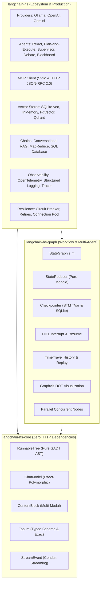

# 🦜️🔗 LangChain Haskell (`langchain-hs`)

> **Functional Programming First AI Agent, Multi-Agent Graph & Production Orchestration Engine**
> 
> *A strictly typed, effect-polymorphic, zero-`unsafePerformIO` Haskell AI ecosystem built on pure AST pipelines, state graphs, algebraic laws, Model Context Protocol (MCP), and production observability.*

---

[]()
[]()
[](https://hackage.haskell.org/package/langchain-hs)
[](LICENSE)

---

## 🌟 Why `langchain-hs`?

`langchain-hs` is designed from first principles to leverage Haskell's unique strengths:

1. **Zero-Dependency Pure Core (`langchain-hs-core`)**: Pure GADT pipeline ASTs (`RunnableTree m i o`), unified multi-modal message model (`ContentBlock`), effect-polymorphic `ChatModel`, and `StreamEvent` streaming protocols without ANY HTTP dependencies.
2. **Type-Safe Graph Engine (`langchain-hs-graph`)**: First-class `StateGraph s m`, pure state merge reducers (`StateReducer s`), thread-safe `MemoryCheckpointer` (`TVar`), persistent `SQLiteCheckpointer`, Time-Travel state replay, Graphviz DOT export, and concurrent parallel node execution via `async`.
3. **Algebraic Laws & Property Verification**: Reducer monoid associativity `(a <> b) <> c == a <> (b <> c)`, runnable left/right identity, and checkpointer invariants verified via QuickCheck properties.
4. **Model Context Protocol (MCP)**: Full JSON-RPC 2.0 client supporting stdio and HTTP transports with automatic discovery and conversion to native `Tool m` definitions.
5. **Advanced Multi-Agent Architectures**: Supervisor teams with capabilities-based delegation, multi-agent debate with convergence checking, majority voting classifiers, and STM shared blackboards.
6. **Production Observability & Resilience**: OpenTelemetry-compatible tracing (`withSpan`), structured contextual logging, three-state Circuit Breaker, event-driven async callbacks, runtime diagnostics, and token cost accounting.

---

## 📊 Feature Matrix: LangChain Ecosystem Comparison

| Feature Area | Python (`langchain`) | Java (`langchain4j`) | Rust (`langchain-rust`) | **Haskell (`langchain-hs`)** |
|:---|:---:|:---:|:---:|:---:|
| **Paradigm & Purity** | Imperative / Dynamic | OOP / Static | Imperative / Static | **Pure Functional & Effect-Polymorphic** |
| **Purity Guarantees** | None | None | None | **Zero `unsafePerformIO`, Law-Verified** |
| **Pipeline Composition** | LCEL (`\|`) | Fluent Builders | Async Chains | **Pure GADT AST (`\|>>`, `&>&`) + DSL (`>>>#`)** |
| **Graph Orchestration** | LangGraph (Python) | External / Basic | None | **`StateGraph`, Parallel Nodes, Time-Travel, DOT** |
| **Multi-Agent Patterns** | CrewAI / AutoGen | Basic Agents | Simple ReAct | **Plan-and-Execute, Supervisor, Debate, Blackboard** |
| **Model Context Protocol (MCP)** | Python Client | Custom SDK | Basic | **Built-in stdio + HTTP JSON-RPC Client** |
| **Human-in-the-Loop (HITL)** | Supported | Partial | Unsupported | **First-class `hitlNode` & `resumeGraph`** |
| **Thread Safety** | GIL / AsyncIO | Locks / Atomicals | Arc / Mutex | **Software Transactional Memory (STM `TVar`)** |
| **Streaming Protocol** | Async Generators | Reactive Streams | Futures Stream | **Conduit Streaming (`StreamEvent` Lifecycle)** |
| **Observability** | LangSmith (SaaS) | OpenTelemetry | Tracing Crate | **OpenTelemetry Spans + Structured Logging** |
| **Resilience** | Tenacity | Resilience4j | Custom | **Circuit Breaker, Exponential Backoff & Jitter** |

---

## 📦 Packages in Monorepo

| Package | Version | Description |
|---|---|---|
| [`langchain-hs-core`](./langchain-hs-core) | `0.2.0.0` | Pure AST pipeline (`RunnableTree`), `ChatModel`, `ContentBlock`, `Tool m`, `StreamEvent`. Zero HTTP deps. |
| [`langchain-hs-graph`](./langchain-hs-graph) | `0.5.0.0` | `StateGraph s m`, `StateReducer s`, Checkpointers, HITL, TimeTravel, Parallel execution, DOT export. |
| [`langchain-hs`](./) | `0.5.0.0` | Providers (Ollama, OpenAI, Gemini), Memory, Vector Stores, Chains, MCP, Observability. |

---

## 🏗️ Architecture



---

## 🚀 Quickstart Examples

### 1. Plan-and-Execute Agent

```haskell
{-# LANGUAGE OverloadedStrings #-}
import Control.Monad.Except (runExceptT)
import Langchain.Prelude

main :: IO ()
main = do
  model <- newOllama "qwen2.5:7b" defaultConfig
  let agent = newPlanAndExecuteAgent model model Nothing

  res <- runExceptT $ runPlanAndExecute agent "Write a Haskell CLI that counts words in text files"
  case res of
    Left err  -> putStrLn ("Error: " ++ show err)
    Right ans -> putStrLn ("Answer:\n" ++ show ans)
```

### 2. Model Context Protocol (MCP) Integration

```haskell
import Langchain.Prelude

mcpExample :: IO ()
mcpExample = do
  -- Connect to MCP server over stdio
  client <- newStdioMcpClient "npx" ["-y", "@modelcontextprotocol/server-everything"]
  
  -- Discover available tools
  mcpTools <- listMcpTools client
  
  -- Convert to standard Langchain Tool instances
  let localTools = map mcpToolToLangchainTool mcpTools
```

### 3. OpenTelemetry Distributed Tracing

```haskell
import Langchain.Prelude
import qualified Data.Map.Strict as Map

otelExample :: IO ()
otelExample = do
  tracer <- newOTelTracer Nothing
  res <- runExceptT $ withSpan tracer "agent_turn" Nothing ClientSpan (Map.singleton "agent" "supervisor") $ do
    -- Execute agent or LLM call
    pure ()
  
  jsonTrace <- exportSpansJson tracer
```

---

## 🧪 Comprehensive Test Suite (329 Automated Tests)

Run all unit, property, regression, and live integration tests:

```bash
# Run all test suites across all packages
stack test

# Run micro-benchmarks with sub-microsecond latency verification
stack bench
```
