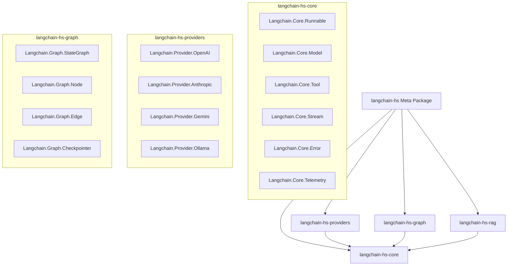

# Technical Design Document (TDD)

## Project: `langchain-hs` 2.0 Architectural Blueprint

- **Status**: Technical Specification
- **Author**: Maintainer & AI Architect
- **Version**: 2.0.0-TDD
- **Target GHC**: GHC 9.4+ (Supports 9.6, 9.8, 9.10)

---

## 1. System Architecture & Module Hierarchy

`langchain-hs` 2.0 is re-architected into modular, loosely coupled components to enable lightweight dependencies and clean separation of concerns.



---

## 2. Type-Safe LCEL GADT Algebra

### 2.1 The Polymorphic Monadic `Runnable`

Unlike version 1.0 which hardcodes `IO`, version 2.0 parameterizes `Runnable` over a monadic effect stack `m`.

```haskell
{-# LANGUAGE GADTs #-}
{-# LANGUAGE TypeFamilies #-}
{-# LANGUAGE FlexibleContexts #-}
{-# LANGUAGE RankNTypes #-}

module Langchain.Core.Runnable
  ( Runnable (..)
  , RunnableTree (..)
  , (|>>)
  , (&>&)
  ) where

import Control.Monad.IO.Class (MonadIO)
import Data.Aeson (Value)
import Langchain.Error (LangchainError)

-- | Core typeclass for components executable in monadic context 'm'
class Monad m => Runnable r m where
  type RunnableInput r :: *
  type RunnableOutput r :: *

  -- | Synchronous invocation
  invoke :: r -> RunnableInput r -> m (Either LangchainError (RunnableOutput r))

  -- | Batch execution over multiple inputs
  batch :: r -> [RunnableInput r] -> m [Either LangchainError (RunnableOutput r)]
  batch r inputs = mapM (invoke r) inputs

-- | Explicit GADT representation of composable pipeline algebra
data RunnableTree m i o where
  -- | Identity runnable
  Id :: RunnableTree m a a
  
  -- | Primitive wrapping any instance of Runnable
  Prim :: Runnable r m => r -> RunnableTree m (RunnableInput r) (RunnableOutput r)
  
  -- | Pure lambda transformation
  Lambda :: (i -> m (Either LangchainError o)) -> RunnableTree m i o
  
  -- | Sequential composition: (i -> m) |>> (m -> o)
  Seq :: RunnableTree m i m_out -> RunnableTree m m_out o -> RunnableTree m i o
  
  -- | Parallel tuple composition: i -> (o1, o2)
  Par :: RunnableTree m i o1 -> RunnableTree m i o2 -> RunnableTree m i (o1, o2)
  
  -- | Branching logic based on conditional runnable
  Branch :: (i -> m Bool) -> RunnableTree m i o -> RunnableTree m i o -> RunnableTree m i o
  
  -- | Fallback strategy on error
  Fallback :: RunnableTree m i o -> RunnableTree m i o -> RunnableTree m i o

-- | Infix sequential composition operator
(|>>) :: RunnableTree m a b -> RunnableTree m b c -> RunnableTree m a c
(|>>) = Seq
infixl 1 |>>

-- | Infix parallel composition operator
(&>&) :: RunnableTree m a b -> RunnableTree m a c -> RunnableTree m a (b, c)
(&>&) = Par
infixl 2 &>&
```

---

## 3. Standardized Message Model & Model Typeclass

### 3.1 Structured Chat Messages & Multi-Modal Payloads

```haskell
module Langchain.Core.Model where

import Data.Text (Text)
import Data.Aeson (Value, ToJSON, FromJSON)
import GHC.Generics (Generic)

data Role
  = RoleSystem
  | RoleUser
  | RoleAssistant
  | RoleTool
  | RoleDeveloper
  deriving (Eq, Show, Generic, ToJSON, FromJSON)

data ContentBlock
  = ContentText Text
  | ContentImage { mimeType :: Text, imageBase64 :: Text }
  | ContentAudio { mimeType :: Text, audioBase64 :: Text }
  deriving (Eq, Show, Generic, ToJSON, FromJSON)

data ToolCall = ToolCall
  { toolCallId   :: Text
  , toolName     :: Text
  , toolArguments:: Value
  } deriving (Eq, Show, Generic, ToJSON, FromJSON)

data Message = Message
  { messageRole     :: Role
  , messageContents :: [ContentBlock]
  , messageName     :: Maybe Text
  , messageToolCalls:: Maybe [ToolCall]
  , messageToolId   :: Maybe Text  -- ^ Associated call ID for RoleTool
  } deriving (Eq, Show, Generic, ToJSON, FromJSON)

-- | Unified interface for chat models
class Monad m => ChatModel model m where
  type ModelConfig model :: *

  generateResponse 
    :: model 
    -> [Message] 
    -> Maybe (ModelConfig model) 
    -> m (Either LangchainError Message)
```

---

## 4. Type-Safe Tool Compiler & Schema Derivation

Using `GHC.Generics` and `Aeson`, tools are compiled from standard Haskell functions with automatic JSON Schema generation.

```haskell
module Langchain.Core.Tool where

import Data.Text (Text)
import Data.Aeson (Value, ToJSON, FromJSON)
import GHC.Generics (Generic)
import Langchain.Core.Error (LangchainError)

-- | Typeclass for statically typed tools
class (FromJSON (ToolInput t), ToJSON (ToolOutput t)) => IsTool t where
  type ToolInput t  :: *
  type ToolOutput t :: *
  
  toolName        :: t -> Text
  toolDescription :: t -> Text
  toolSchema      :: t -> Value  -- ^ JSON Schema of ToolInput
  executeTool     :: Monad m => t -> ToolInput t -> m (Either LangchainError (ToolOutput t))

-- | Dynamic heterogenous tool wrapper for LLM runtime dispatch
data DynamicTool m = DynamicTool
  { dynToolName        :: Text
  , dynToolDescription :: Text
  , dynToolSchema      :: Value
  , dynToolExecute     :: Value -> m (Either LangchainError Value)
  }
```

---

## 5. Streaming Event Protocol (`astream_events`)

Streaming uses **`Conduit`** pipelines yielding fine-grained `StreamEvent` tokens to eliminate blocking and memory overhead.

```haskell
module Langchain.Core.Stream where

import Data.Conduit (ConduitT)
import Data.Text (Text)
import Data.Aeson (Value)
import Langchain.Core.Model (Message, ToolCall)

data StreamEvent
  -- LLM Events
  = EventLLMStart  { runId :: Text, modelName :: Text, prompt :: [Message] }
  | EventLLMChunk  { runId :: Text, chunkText :: Text, chunkToolCall :: Maybe ToolCall }
  | EventLLMFinish { runId :: Text, finalMessage :: Message }
  
  -- Tool Events
  | EventToolStart { runId :: Text, toolName :: Text, inputArgs :: Value }
  | EventToolEnd   { runId :: Text, toolName :: Text, outputVal :: Value }
  | EventToolError { runId :: Text, toolName :: Text, errorMessage :: Text }
  
  -- Chain Events
  | EventChainStart{ runId :: Text, chainName :: Text }
  | EventChainEnd  { runId :: Text, chainName :: Text }
  deriving (Eq, Show)

-- | Stream handler typealias using Conduit
type EventStream m = ConduitT () StreamEvent m ()
```

---

## 6. State Graph Agent Engine (LangGraph-hs)

The core agent framework models agents as **Directed Cyclic Graphs** with state transitions.

```haskell
module Langchain.Graph.StateGraph where

import Data.Map.Strict (Map)
import Data.Text (Text)
import Langchain.Core.Error (LangchainError)

newtype NodeId = NodeId Text deriving (Eq, Ord, Show)

-- | State reducer pure function
type StateReducer s = s -> s -> s

-- | Node execution logic
newtype Node s m = Node { runNode :: s -> m (Either LangchainError s) }

-- | Conditional edge routing
data Edge s m
  = StaticEdge NodeId
  | ConditionalEdge (s -> m (Either LangchainError NodeId))

-- | Durable state graph definition
data StateGraph s m = StateGraph
  { graphNodes      :: Map NodeId (Node s m)
  , graphEdges      :: Map NodeId [Edge s m]
  , graphEntryPoint :: NodeId
  , graphFinishPoint:: NodeId
  }

-- | Checkpointer interface for persistent state & human-in-the-loop
class Monad m => Checkpointer cp m where
  saveCheckpoint :: cp -> Text -> Value -> m ()
  loadCheckpoint :: cp -> Text -> m (Maybe Value)
```

---

## 7. Telemetry & Observability Architecture

```haskell
module Langchain.Core.Telemetry where

import Data.Text (Text)
import Data.Time.Clock (UTCTime)
import Data.Map (Map)
import Data.Aeson (Value)

data Span = Span
  { spanId        :: Text
  , parentSpanId  :: Maybe Text
  , traceId       :: Text
  , spanName      :: Text
  , startTime     :: UTCTime
  , endTime       :: Maybe UTCTime
  , spanAttributes:: Map Text Value
  }

class Monad m => MonadTracer m where
  withSpan :: Text -> m a -> m a
  addSpanAttribute :: Text -> Value -> m ()
```

---

## 8. Migration Plan & File Blueprint for `langchain-hs` 2.0

| Old File (`v1.0`) | Flaws in `v1.0` | New Architecture Location (`v2.0`) |
| :--- | :--- | :--- |
| `src/Langchain/LLM/Core.hs` | Hardcoded IO; crude StreamHandler callback. | `langchain-hs-core/Langchain/Core/Model.hs` |
| `src/Langchain/Runnable/Core.hs` | Concrete IO; non-compositional `invoke`. | `langchain-hs-core/Langchain/Core/Runnable.hs` |
| `src/Langchain/Runnable/Chain.hs` | `(|>>)` executes immediately instead of constructing AST. | `langchain-hs-core/Langchain/Core/Runnable.hs` |
| `src/Langchain/Tool/Core.hs` | Raw string input/output; missing JSON Schema compiler. | `langchain-hs-core/Langchain/Core/Tool.hs` |
| `src/Langchain/Agent/Core.hs` | Rigid imperative loop in IO; no graph state machine. | `langchain-hs-graph/Langchain/Graph/StateGraph.hs` |
| `src/Langchain/Callback.hs` | Basic side-effecting record callbacks. | `langchain-hs-core/Langchain/Core/Stream.hs` |
