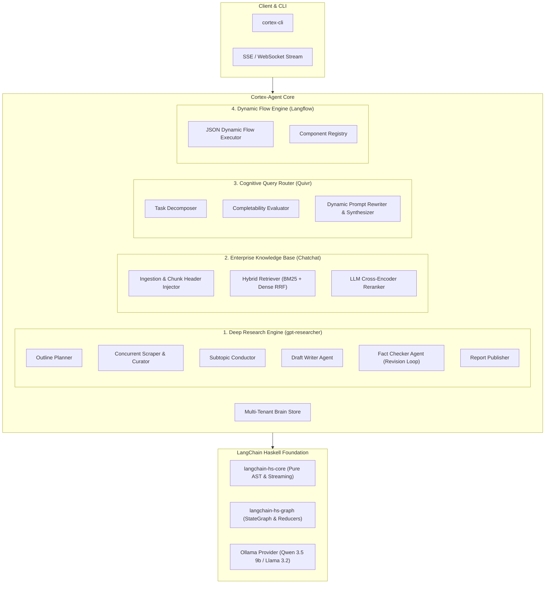

# 🧠 Cortex-Agent

> **Cognitive Multi-Agent Deep Research & Enterprise Second-Brain Engine in Haskell**
>
> *Built on `langchain-hs`, `langchain-hs-core`, and `langchain-hs-graph` — combining the architectures of `gpt-researcher`, `Langchain-Chatchat`, `quivr`, and `langflow`.*

---

[]()
[]()
[](LICENSE)

---

## 🌟 Capabilities

### 1. 🔍 Autonomous Deep Research Engine (*Inspired by `gpt-researcher`*)
- **Chief Editor Orchestrator**: Plans research outlines, generates breadth/depth subtopic trees, and coordinates specialist sub-agents.
- **Concurrent Web Scraper & Context Curator**: Concurrent async HTTP fetching with TagSoup clean text extraction, rate-limiting, and word-budget context pruning (`MAX_CONTEXT_WORDS = 25000`).
- **Multi-Agent Writer & Fact-Checking Revision Loop**: `WriterAgent` drafts comprehensive sections with citations, while `FactCheckerAgent` extracts claims and verifies them against source evidence in a bounded revision loop.
- **Publication-Grade Reports**: Generates structured Markdown reports complete with executive summaries, table of contents, and a bibliography table with source word metrics.

### 2. 🗄️ Enterprise Knowledge Base & Hybrid RAG (*Inspired by `Langchain-Chatchat`*)
- **Multi-Tenant Brain Isolation**: Dedicated knowledge namespaces with independent SQLite storage, model parameters, and prompt configurations.
- **Chunk Header Enrichment**: Injects structured document metadata (`[Header: brain_id | source | chunk_index]`) into chunk text for higher retrieval precision.
- **Hybrid Sparse + Dense Retrieval**: Fuses BM25 inverted index keyword search with dense vector similarity via Reciprocal Rank Fusion (RRF).
- **LLM / Cross-Encoder Reranking**: Re-evaluates top candidate passages (0.0 to 10.0 score) before synthesis.

### 3. 🧩 Cognitive Task Decomposer & Router (*Inspired by `quivr`*)
- **`SplittedInput`**: Breaks down complex user requests and conversation history into explicit instructions, reasoning rationale, and atomic sub-tasks.
- **`TasksCompletion` Evaluator**: Evaluates whether tasks can be answered from current context or require external tool activation.
- **Dynamic System Prompt Rewriting**: Tailors transient system prompts to active tasks before multi-step synthesis.

### 4. ⚡ Declarative Dynamic Flow Runtime (*Inspired by `langflow`*)
- **JSON Flow Graph Interpreter**: Parses and executes arbitrary node graphs with cycle detection, topological ordering, and socket data routing.
- **Pre-Built Component Catalog**: Prompts, LLMs, Brain Retrievers, Web Scrapers, and Evaluators.
- **Real-Time Telemetry**: Server-Sent Events (SSE) and WebSocket protocol for live intermediate progress streaming.

---

## 🏗️ Architecture



---

## 🚀 CLI Quickstart

```bash
# Run autonomous deep research
cortex-cli research "Quantum Computing Algorithms"

# Create a new second-brain
cortex-cli brain create "Engineering Knowledge Base"
```
