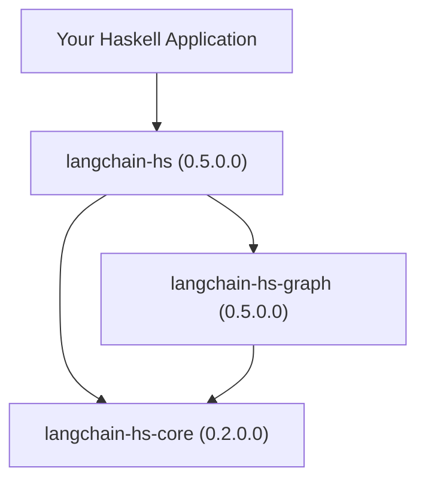

## Monorepo Breakdown

The `langchain-hs` ecosystem is organized into three distinct packages:

| Package | Version | Hackage | Source | Description |
|---|---|---|---|---|
| **`langchain-hs-core`** | `0.2.0.0` | [Hackage ↗](https://hackage.haskell.org/package/langchain-hs-core) | [`./langchain-hs-core`](https://github.com/tusharad/langchain-hs/tree/develop/langchain-hs-core) | Pure AST pipelines (`RunnableTree`), `ChatModel`, `ContentBlock`, `Tool m`, `StreamEvent`. Zero HTTP dependencies. |
| **`langchain-hs-graph`** | `0.5.0.0` | [Hackage ↗](https://hackage.haskell.org/package/langchain-hs-graph) | [`./langchain-hs-graph`](https://github.com/tusharad/langchain-hs/tree/develop/langchain-hs-graph) | `StateGraph s m`, `StateReducer s`, Checkpointers (STM & SQLite), HITL, TimeTravel, Parallel nodes, Graphviz DOT export. |
| **`langchain-hs`** | `0.5.0.0` | [Hackage ↗](https://hackage.haskell.org/package/langchain-hs) | [`./`](https://github.com/tusharad/langchain-hs) | Umbrella ecosystem: Providers (Ollama, OpenAI, Gemini), MCP Client, Vector Stores, Chains, Multi-Agent Teams, OpenTelemetry. |

---

## Dependency Graph

---

## Community & Feedback

- **GitHub Issues**: [github.com/tusharad/langchain-hs/issues](https://github.com/tusharad/langchain-hs/issues)
- **Discord Community**: [Join the Discord Server](https://discord.gg/swpKq59RJA)
- **Maintainer**: Tushar Adhatrao `<tusharadhatrao@gmail.com>`
