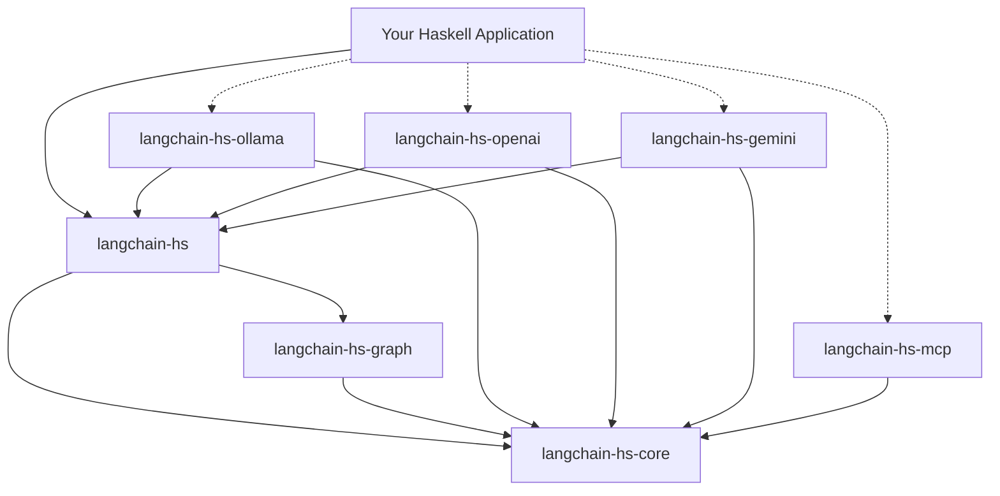

## Monorepo Breakdown

The `langchain-hs` ecosystem is organized into modular packages to ensure a lightweight core and optional, decoupled provider integrations:

| Package | Version | Hackage | Source | Description |
|---|---|---|---|---|
| **`langchain-hs-core`** | `0.0.6.0` | [Hackage ↗](https://hackage.haskell.org/package/langchain-hs-core) | [`./langchain-hs-core`](https://github.com/tusharad/langchain-hs/tree/develop/langchain-hs-core) | Pure AST pipelines (`RunnableTree`), `ChatModel`, `ContentBlock`, `Tool m`, `StreamEvent`. Zero network/HTTP dependencies. |
| **`langchain-hs-graph`** | `0.0.6.0` | [Hackage ↗](https://hackage.haskell.org/package/langchain-hs-graph) | [`./langchain-hs-graph`](https://github.com/tusharad/langchain-hs/tree/develop/langchain-hs-graph) | `StateGraph s m`, `StateReducer s`, Checkpointers (STM & SQLite), HITL, TimeTravel, Parallel nodes, Graphviz DOT export. |
| **`langchain-hs`** | `0.0.6.0` | [Hackage ↗](https://hackage.haskell.org/package/langchain-hs) | [`./`](https://github.com/tusharad/langchain-hs) | Core framework: Agents (`ReAct`, `PlanAndExecute`), Output Parsers, Vector Stores, Chains, Memory, Resilience, OpenTelemetry. |
| **`langchain-hs-ollama`** | `0.0.6.0` | [Hackage ↗](https://hackage.haskell.org/package/langchain-hs-ollama) | [`./langchain-hs-ollama`](https://github.com/tusharad/langchain-hs/tree/develop/langchain-hs-ollama) | Dedicated Ollama provider and embeddings integration via `ollama-haskell`. |
| **`langchain-hs-openai`** | `0.0.6.0` | [Hackage ↗](https://hackage.haskell.org/package/langchain-hs-openai) | [`./langchain-hs-openai`](https://github.com/tusharad/langchain-hs/tree/develop/langchain-hs-openai) | Dedicated OpenAI & OpenAI-compatible provider, streaming, and embeddings via `openai`. |
| **`langchain-hs-gemini`** | `0.0.6.0` | [Hackage ↗](https://hackage.haskell.org/package/langchain-hs-gemini) | [`./langchain-hs-gemini`](https://github.com/tusharad/langchain-hs/tree/develop/langchain-hs-gemini) | Dedicated Google Gemini provider with function calling and SSE streaming. |
| **`langchain-hs-mcp`** | `0.0.6.0` | [Hackage ↗](https://hackage.haskell.org/package/langchain-hs-mcp) | [`./langchain-hs-mcp`](https://github.com/tusharad/langchain-hs/tree/develop/langchain-hs-mcp) | Model Context Protocol client over stdio and HTTP JSON-RPC 2.0. |

---

## Dependency Graph

```mermaid
flowchart TD
    App[Your Haskell Application] --> LangchainHs["langchain-hs"]
    App -.-> Ollama["langchain-hs-ollama"]
    App -.-> OpenAI["langchain-hs-openai"]
    App -.-> Gemini["langchain-hs-gemini"]
    App -.-> MCP["langchain-hs-mcp"]
    
    LangchainHs --> LangchainHsGraph["langchain-hs-graph"]
    LangchainHs --> LangchainHsCore["langchain-hs-core"]
    LangchainHsGraph --> LangchainHsCore
    
    Ollama --> LangchainHs
    Ollama --> LangchainHsCore
    OpenAI --> LangchainHs
    OpenAI --> LangchainHsCore
    Gemini --> LangchainHs
    Gemini --> LangchainHsCore
    MCP --> LangchainHsCore
```

---

## Community & Feedback

- **GitHub Issues**: [github.com/tusharad/langchain-hs/issues](https://github.com/tusharad/langchain-hs/issues)
- **Discord Community**: [Join the Discord Server](https://discord.gg/swpKq59RJA)
- **Maintainer**: Tushar Adhatrao `<tusharadhatrao@gmail.com>`
