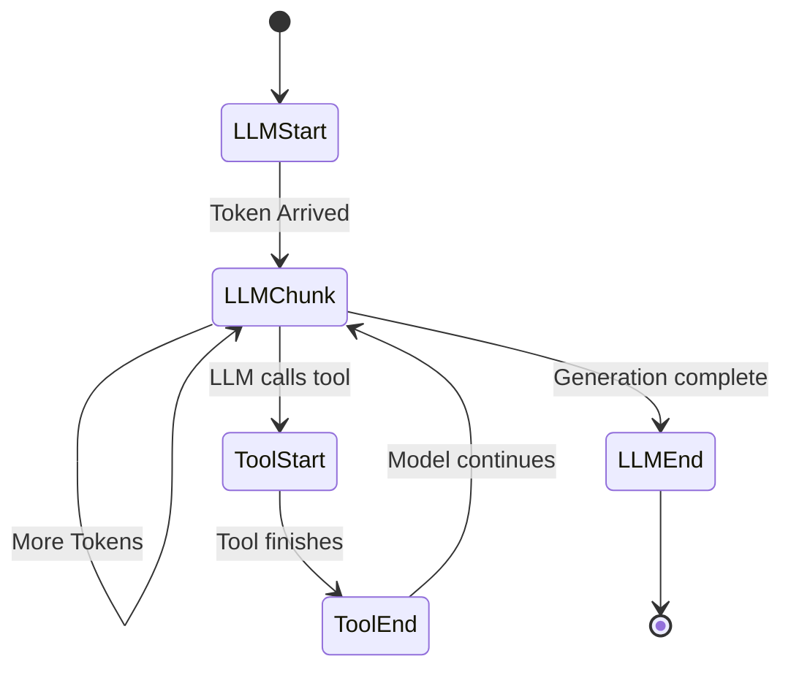

## The `ChatModel` Abstraction

In `langchain-hs`, language models implement the `ChatModel` typeclass:

```haskell
class (MonadIO m, MonadError LangchainError m) => ChatModel model m where
  -- | Synchronous invocation with full response message
  invoke :: model -> [Message] -> m Message
  
  -- | Invocation with custom execution configuration (temperature, max tokens, etc.)
  invokeWithConfig :: model -> [Message] -> ModelConfig -> m Message
  
  -- | Streaming conduit output delivering real-time lifecycle events
  streamModel :: model -> [Message] -> (StreamEvent -> m ()) -> m ()
```

---

## Unified Multi-Modal Message Model

Messages are represented using typed roles and structured `ContentBlock` sequences:

```haskell
data Message = Message
  { messageRole     :: Role
  , messageContent  :: [ContentBlock]
  , messageMetadata :: Map Text Value
  }

data Role
  = SystemRole
  | UserRole
  | AssistantRole
  | ToolRole
```

### `ContentBlock` Types

`ContentBlock` unifies text, base64/URL images, tool invocations, and tool results:

```haskell
data ContentBlock
  = TextBlock Text
  | ImageBlock ImageSource ImageMediaType
  | ToolUseBlock ToolCallId ToolName (Map Text Value)
  | ToolResultBlock ToolCallId ToolResultStatus Text
```

### Helper Constructors

```haskell
-- Simple text messages
sysMsg  = systemMessage "You are an expert Haskell compiler engineer."
userMsg = userMessage "Why are Monads monoids in the category of endofunctors?"

-- Multi-modal image message
imgMsg  = imageMessage "Describe the graph in this chart" "image/png" imageBytes
```

---

## Streaming Event Lifecycle (`StreamEvent`)

When streaming responses with `streamModel`, `langchain-hs` emits structured events throughout the invocation lifecycle:



```haskell
data StreamEvent
  = LLMStart
  | LLMChunk Text
  | LLMEnd TokenUsage
  | ToolStart ToolCall
  | ToolEnd Text
  | ToolErrorEvent Text
  | ChainStart Text
  | ChainEnd Text
  | NodeStart Text
  | NodeEnd Text
```
