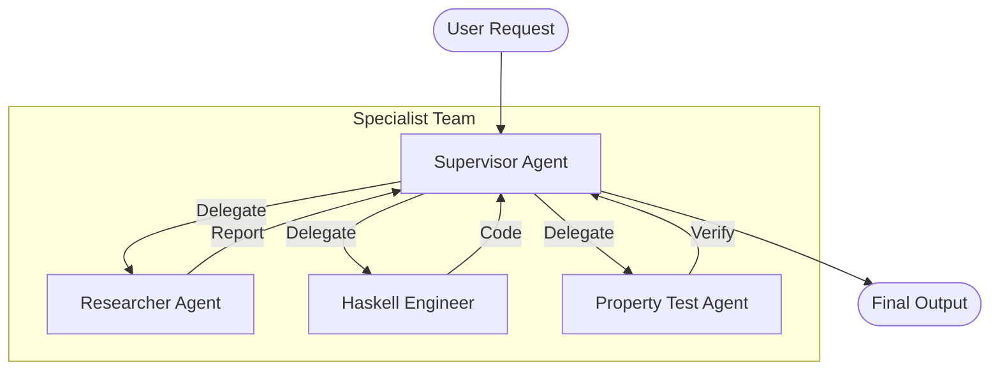

## Multi-Agent Paradigms

`langchain-hs` provides several battle-tested patterns for coordinating multiple specialized agents.



---

## 1. Supervisor Team

A `SupervisorTeam` uses a centralized coordinator LLM to inspect sub-agent descriptions and dynamically delegate tasks until the objective is accomplished:

```haskell
import Langchain.Prelude

-- Define specialist agents with clear capability boundaries
researcher = SpecialistAgent
  { agentName = "researcher"
  , agentDescription = "Searches scientific papers and retrieves documentation."
  , agentTools = [webSearchTool, docRetrieverTool]
  }

coder = SpecialistAgent
  { agentName = "coder"
  , agentDescription = "Writes idiomatic Haskell implementations."
  , agentTools = [ghcTypecheckTool]
  }

-- Create supervisor with a max turn limit of 10
team = newSupervisorTeam coordinatorModel [researcher, coder] 10

main :: IO ()
main = do
  result <- runSupervisorTeam team "Research STM algorithms and write a Haskell queue"
  print result
```

---

## 2. Multi-Agent Debate

`runDebate` coordinates two or more debaters arguing opposite viewpoints, terminating when consensus is reached or iterations are exhausted:

```haskell
data Debater = Debater
  { debaterName :: Text
  , debaterRole :: Text
  , debaterModel :: ChatModelInstance
  }

config = defaultDebateConfig { maxRounds = 4, requireConsensus = True }

runDebate config [proDebater, conDebater] "Should Haskell be used for AI agent backends?"
```

---

## 3. Majority Voting Classifier

Query multiple models in parallel and calculate consensus via semantic majority voting:

```haskell
classifier = newVotingClassifier [model1, model2, model3]
consensusAnswer <- runVotingClassification classifier "Is this SQL query safe to run?"
```

---

## 4. Shared Blackboard (STM)

The `Blackboard` architecture enables multiple independent `KnowledgeSource` workers to observe a shared state board in STM, propose edits, and coordinate non-blocking problem solving.
