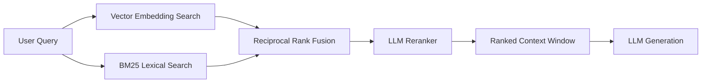

## Retrieval-Augmented Generation (RAG)

`langchain-hs` provides a comprehensive RAG toolset covering document loading, chunking, dense vector retrieval, sparse lexical search (BM25), and hybrid rank fusion.



---

## 1. Vector Stores

`langchain-hs` supports multiple vector store backends implementing the `VectorStore` typeclass:

- **`InMemory`**: Zero-dependency vector store using cosine similarity.
- **`SqliteVecStore`**: Local, single-file vector storage via `sqlite-vec`.
- **`PgVectorStore`**: Production PostgreSQL vector storage via `pgvector`.
- **`QdrantStore`**: Scalable cloud vector database integration.

```haskell
-- In-memory vector store example
store <- emptyInMemoryVectorStore embeddings
storeWithDocs <- addDocuments store [doc1, doc2, doc3]

-- Similarity search top 3 matches
results <- similaritySearch storeWithDocs "monadic parser combinators" 3
```

---

## 2. Hybrid Retrieval with BM25 + RRF

Dense vector search can miss exact keyword matches (e.g. error codes, variable names). `HybridRetriever` combines dense vectors and sparse BM25 scoring using **Reciprocal Rank Fusion (RRF)**:

```haskell
import Langchain.Prelude

main :: IO ()
main = do
  -- 1. Initialize BM25 and Vector store
  let bm25 = newBM25Index documents
  let vectorStore = fromDocuments embeddings documents

  -- 2. Construct Hybrid Retriever (weight 0.6 vector, 0.4 BM25)
  let hybrid = newHybridRetrieverWithWeights vectorStore bm25 0.6 0.4

  -- 3. Search with Reciprocal Rank Fusion
  rankedDocs <- searchHybrid hybrid "GHC-87391 type error" 5
  print rankedDocs
```

---

## 3. Advanced Retrievers

- **`ParentDocumentRetriever`**: Indexes small sub-chunks for precise vector matching, but returns the larger parent document chunk for rich LLM context.
- **`MultiQueryRetriever`**: Uses an LLM to generate multiple alternate phrasings of a user query and aggregates retrieved results across all queries.
- **`ContextualCompressionRetriever`**: Uses an LLM or compression filter to strip irrelevant text from retrieved documents before passing them to the prompt.
