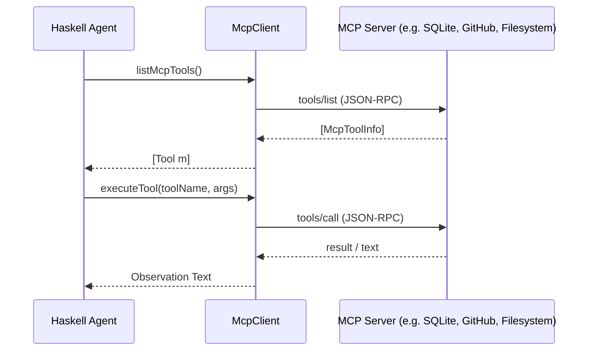

## What is a `Tool`?

A `Tool m` encapsulates a capability an agent can invoke:

```haskell
data Tool m = Tool
  { toolName        :: Text
  , toolDescription :: Text
  , toolParameters  :: Value   -- JSON Schema object defining parameter types
  , toolExecute     :: Map Text Value -> m Text
  }
```

---

## Automatic Schema Derivation

You can derive JSON schema definitions from native Haskell types using `DeriveToolSchema`:

```haskell
{-# LANGUAGE DeriveGeneric #-}
{-# LANGUAGE DeriveAnyClass #-}

import GHC.Generics (Generic)
import Data.Aeson (FromJSON, ToJSON)
import Langchain.Prelude

data SearchParams = SearchParams
  { query      :: Text
  , maxResults :: Maybe Int
  } deriving (Generic, FromJSON, ToJSON, DeriveToolSchema)

searchTool :: Tool IO
searchTool = createTool
  "web_search"
  "Search the internet for current technical documentation"
  (deriveToolParametersSchema @SearchParams)
  (\(SearchParams q limit) -> performSearch q (fromMaybe 5 limit))
```

---

## Model Context Protocol (MCP) Client

`langchain-hs` includes a native client for Anthropic's **Model Context Protocol (MCP)** specification over JSON-RPC 2.0.



### Stdio and HTTP Transports

```haskell
import Langchain.Prelude

-- Connect over Stdio (e.g. npx MCP servers)
stdioClient <- newStdioMcpClient "npx" ["-y", "@modelcontextprotocol/server-filesystem", "/tmp"]

-- Connect over HTTP SSE
httpClient <- newHttpMcpClient "http://localhost:8000/sse"

-- Introspect available MCP tools
tools <- listMcpTools stdioClient

-- Convert MCP tools to native Langchain Tool definitions
let nativeTools = map mcpToolToLangchainTool tools
```

<div class="admonition tip">
  <div class="admonition-title">🚀 Seamless Ecosystem Integration</div>
  Any MCP server (PostgreSQL, GitHub, Memory, Filesystem, Slack, Brave Search) works out of the box in <code>langchain-hs</code> without custom wrapper code!
</div>
