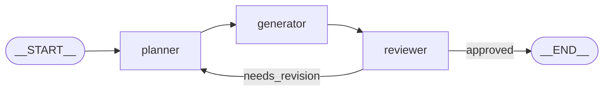

## What is a `StateGraph`?

`langchain-hs-graph` brings the power of **LangGraph** to Haskell. A `StateGraph s m` is a cyclic state machine where nodes process an application state `s` and pass updates back to a central pure state reducer.

Key guarantees in Haskell:
- **Zero Mutability**: State updates are merged using pure `StateReducer s` (Monoid laws).
- **Thread Safety**: Concurrent parallel nodes and STM `TVar` checkpointers.
- **Resumability**: State serialization with `MemoryCheckpointer` or `SQLiteCheckpointer`.
- **Time-Travel**: Full snapshot history inspection and rollbacks.



---

## 1. Defining the State and Reducer

Let's define a state type and an associative reducer:

```haskell
{-# LANGUAGE OverloadedStrings #-}

import Data.Text (Text)
import Langchain.Prelude

data WorkflowState = WorkflowState
  { draftText :: Text
  , critique  :: Text
  , iterations :: Int
  } deriving (Show, Eq)

-- A pure reducer that updates state fields predictably
workflowReducer :: StateReducer WorkflowState
workflowReducer = StateReducer $ \old new ->
  WorkflowState
    { draftText = if draftText new /= "" then draftText new else draftText old
    , critique  = if critique new /= "" then critique new else critique old
    , iterations = iterations old + 1
    }
```

---

## 2. Defining Graph Nodes

Nodes are simple effectful functions `s -> m s`:

```haskell
plannerNode :: WorkflowState -> IO WorkflowState
plannerNode st = do
  putStrLn "Executing [planner] node..."
  pure st { draftText = "Draft v" <> show (iterations st) <> ": Haskell State Graphs" }

generatorNode :: WorkflowState -> IO WorkflowState
generatorNode st = do
  putStrLn "Executing [generator] node..."
  pure st { draftText = draftText st <> " (Expanded with LangGraph details)" }

reviewerNode :: WorkflowState -> IO WorkflowState
reviewerNode st = do
  putStrLn "Executing [reviewer] node..."
  if iterations st >= 2
    then pure st { critique = "APPROVED" }
    else pure st { critique = "NEEDS_WORK" }
```

---

## 3. Constructing & Compiling the Graph

Wire nodes, edges, and conditional routing:

```haskell
import Data.Function ((&))

buildWorkflow :: StateGraph WorkflowState IO
buildWorkflow = emptyStateGraph workflowReducer
  & addNode "planner" plannerNode
  & addNode "generator" generatorNode
  & addNode "reviewer" reviewerNode
  & addEdge startNodeId "planner"
  & addEdge "planner" "generator"
  & addEdge "generator" "reviewer"
  & addConditionalEdge "reviewer" (\st -> 
      if critique st == "APPROVED" then endNodeId else "planner")
      [ ("approved", endNodeId)
      , ("needs_work", "planner")
      ]

main :: IO ()
main = do
  -- 1. Create a thread-safe STM checkpointer
  checkpointer <- newMemoryCheckpointer
  
  -- 2. Compile the graph
  let compiled = compileGraph buildWorkflow (Just checkpointer)

  -- 3. Run the graph with initial state
  let initialState = WorkflowState "" "" 0
  finalState <- runGraph compiled initialState

  putStrLn "--- Workflow Completed ---"
  print finalState
```

<div class="admonition note">
  <div class="admonition-title">📊 Graphviz Visualization</div>
  You can export any <code>StateGraph</code> to standard DOT format using <code>toDot buildWorkflow</code> and render it with Graphviz or Mermaid!
</div>
