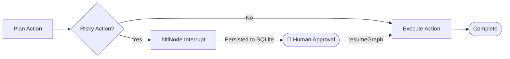

## Human-in-the-Loop in `StateGraph`

In high-stakes enterprise applications (e.g. database schema mutations, financial transfers, code deployment), autonomous agents should pause execution at critical nodes to await human confirmation or feedback before continuing.



---

## 1. Defining a `hitlNode`

In `langchain-hs-graph`, `hitlNode` pauses graph execution and saves a checkpoint snapshot:

```haskell
{-# LANGUAGE OverloadedStrings #-}

import Langchain.Prelude

data DeploymentState = DeploymentState
  { targetEnv :: Text
  , migrationSQL :: Text
  , isApproved :: Bool
  }

-- Node that interrupts execution for human sign-off
approvalNode :: Node DeploymentState IO
approvalNode = hitlNode "approval" (\st -> do
  putStrLn $ "--- ACTION REQUIRED: Review SQL Migration for " <> show (targetEnv st) <> " ---"
  putStrLn $ show (migrationSQL st)
  -- Graph execution pauses here and writes state to SQLite!
  )
```

---

## 2. Resuming Execution

Once the human reviews and approves the payload, resume the graph from its checkpoint:

```haskell
resumeWorkflow :: SQLiteCheckpointer -> Text -> IO ()
resumeWorkflow checkpointer threadId = do
  -- Load checkpointed state
  Just pausedState <- loadCheckpoint checkpointer threadId
  
  -- Update state with approval
  let approvedState = pausedState { isApproved = True }

  -- Resume graph from paused node
  finalResult <- resumeGraph compiled approvedState
  print finalResult
```
